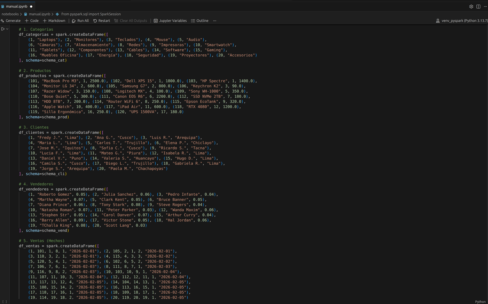
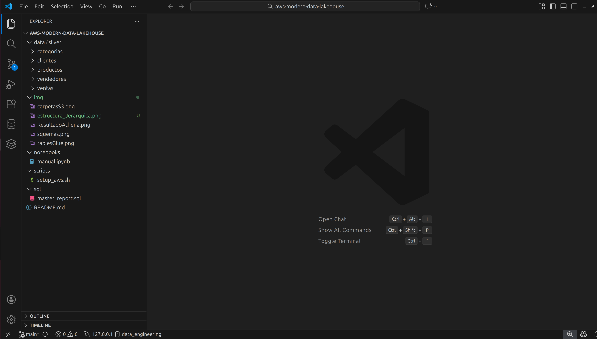
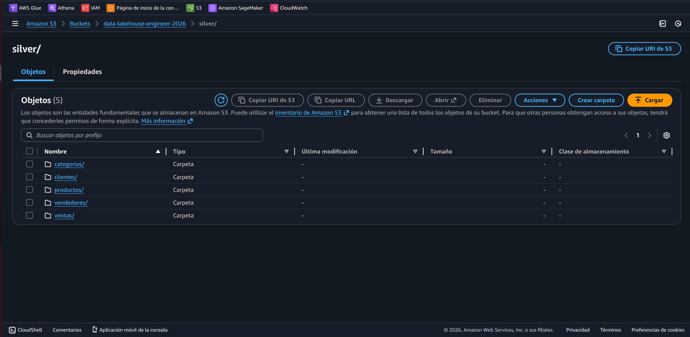
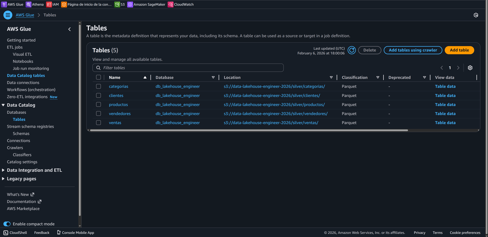
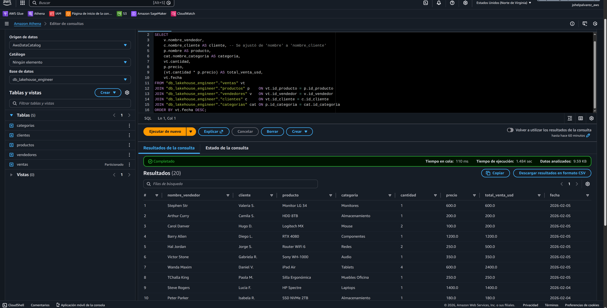

# 🚀 Enterprise Data Lakehouse: Arquitectura de Medallón en AWS
**Ingeniería de datos de alto impacto: De PySpark local a la analítica serverless en la nube**

Este proyecto implementa una arquitectura **Data Lakehouse** de nivel empresarial, diseñada para eliminar silos de datos mediante una **Capa Silver** optimizada. La solución integra el procesamiento distribuido de PySpark con la escalabilidad elástica de AWS, garantizando una "Única Fuente de Verdad" (SSOT).

---

## 🏗️ 1. Estrategia de Ingeniería y Gobernanza

### 🛡️ Contratos de Datos (Data Contracts) con PySpark
Se impone **Gobernanza Proactiva** desde la ingesta para evitar la degradación de la calidad del dato:
* **Esquemas Estrictos (`StructType`)**: Implementación de contratos técnicos para asegurar la integridad referencial.
* **Eficiencia Columnar**: Uso de **Apache Parquet** para maximizar la compresión y el rendimiento.

  
*Figura 1: Implementación de esquemas maestros en PySpark para la consistencia del catálogo.*

---

## 🛠️ 2. Orquestación e Infraestructura Cloud

### 🗄️ Persistencia y Organización Modular
La arquitectura sigue el estándar de **Separación de Responsabilidades** para facilitar el mantenimiento:
* **Estructura Jerárquica**: Organización modular del repositorio (data, notebooks, scripts, sql).
* **Almacenamiento en S3**: Persistencia física de las entidades fundamentales en el bucket oficial.

  
*Figura 2: Jerarquía profesional del repositorio en VS Code.*

  
*Figura 3: Capas de almacenamiento optimizadas en Amazon S3.*

### 🤖 Descubrimiento Automatizado (AWS Glue)
Se utiliza **AWS Glue Data Catalog** para el desacoplamiento entre almacenamiento y consumo:
* **Catálogo Dinámico**: Sincronización de metadatos para acceso inmediato desde herramientas analíticas.

  
*Figura 4: Sincronización exitosa del catálogo de metadatos.*

---

## 🔍 3. Validación y Valor de Negocio (Amazon Athena)

### 📈 Reporte Maestro Consolidado
Se validó la integridad del modelo mediante un reporte que integra las 5 dimensiones del negocio, logrando latencias de consulta mínimas sobre archivos Parquet.

  
*Figura 5: Ejecución analítica que demuestra la eficiencia del Data Lakehouse.*

---

## 🧠 4. Bitácora de Ingeniería (Troubleshooting)

* **Higiene del Catálogo**: Remoción de redundancias en Glue para asegurar una fuente de verdad única.
* **Portabilidad**: Configuración de rutas relativas para garantizar la ejecución agnóstica del pipeline.

---

## 🔮 5. Roadmap: Siguiente Proyecto (Arquitectura 2.0)

Evolución planificada hacia la hiper-automatización:
* **AWS Lambda Triggers**: Procesamiento por eventos de S3.
* **Gobernanza Avanzada**: Seguridad a nivel de columna con AWS Lake Formation.

---

## 🏗️ Stack Tecnológico

  
  
  

---
**Desarrollado por Fredy Johel Peña Alvarez** *Ingeniero de Datos Senior en Formación*